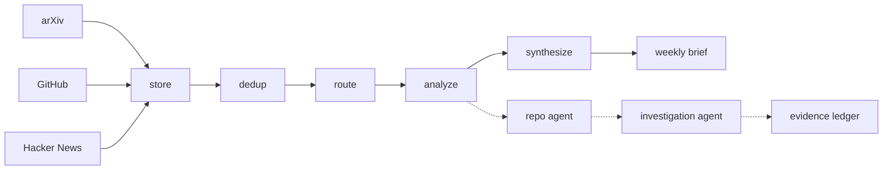

# Proofrun

An investigation agent that answers questions about AI repositories by reading
them, searching the web, and **running them in a sandbox** — and that keeps an
evidence ledger separating what it *observed* by running a command, and what it
*inspected* in the repository's metadata, from what it merely *read* in
someone's prose.

The name is that distinction: a proof run is a trial run you do before you
commit, and the only evidence Proofrun treats as first-hand is the kind it
produced itself.

It sits on top of a monitor that watches arXiv, GitHub, and Hacker News,
scores each item against configured interest areas, and writes a weekly themed
brief — which is where the questions come from.

Built to be honest about what it is, including where it fails. It currently
passes **8 of 13** questions on its own eval, and the five failures are
enumerated below rather than omitted.

---

## A real investigation

Question: *Does `microsoft/apm` actually turn an `apm.yml` manifest into
configured agent files with a single command?*

```
s1   get_repo_metadata(microsoft/apm)      MIT · Python · 43,847 kb
s1   list_files(/)                         .agents/ .apm/ apm.yml ...
s2   read_file(README.md)                  "one command reproduces it everywhere"
                                           ← a claim, not evidence
s3   sandbox_clone()                       git clone --depth 1 → 54.8 MB
s4   sandbox_setup(pip install -e .)       19.7s, exit 0
s5   sandbox_run(apm --version; apm --help)
s6   sandbox_run(apm init --help)
s7   read_file(apm.yml)                    a real manifest, 7 dependencies
s8   sandbox_run(rm -rf .agents .github/agents ...)   ← delete the outputs
s9   sandbox_run(find .agents/skills .github/agents)  ← prove they're gone
s10  sandbox_run(md5sum ...)               ERROR  command not found
s11  sandbox_run(md5sum ...)               ERROR  missing file
s12  sandbox_run(ls .github/agents; ls .agents/skills)
s13  sandbox_run(apm install)              ← re-run it, check they come back

verdict: supported     stop_reason: sufficient_info
14 steps (the 14th answered, with no tool call) · 14 tool calls
$0.596 · 100s · clone 54.8 MB · volume 149 MB
```

The shape of steps 8–13 is the point. The agent was not told to design an
experiment; it deleted the artifacts the claim is about, confirmed they were
gone, ran the single command, and checked they returned. Steps 10 and 11 are
failed commands, left in because a trace that hides its own dead ends is not a
trace.

The ledger it produced (6 entries, a second README quote elided), with the kind of each:

```
[reported ] for  "One file describes every agent's context; one command
                  reproduces it everywhere"          ← read_file(README.md)
[reported ] for  The repo ships a real apm.yml manifest declaring local path
                  dependencies                       ← read_file(apm.yml)
[observed ] for  apm install resolved 7 transitive dependencies and
                  materialized SKILL.md, agent definition and instruction
                  files on disk                      ← sandbox_run, step 8-9
[observed ] for  A second install from a clean state completed and reported
                  21 agent files                     ← sandbox_run, step 13
[observed ] ???  The byte-identical reproduction check failed to run
                  (command-not-found)                ← sandbox_run, step 10-13
```

The first two entries are the project describing itself. Only the third and
fourth are evidence, and the verdict rests on them — the rules below would have
refused `supported` on the README alone.

### And an investigation that correctly refused

Question: *Is `maximhq/bifrost` actually fifty times faster than LiteLLM, as
its description claims?*

```
s1  get_repo_metadata(maximhq/bifrost)   Apache-2.0 · Go · 967,590 kb
s1  read_file(README.md)                  truncated before any benchmark section
s2  bash_code_execution(echo ...)         returned null
s2  list_files(/)
s3  read_file(docs/media/*.png)           ERROR  cannot decode (binary)
s3  list_files(tests)
s4  web_search("Bifrost benchmark 50x faster LiteLLM")
s4  web_search("bifrost benchmark methodology LiteLLM comparison")

verdict: could_not_test   blockers: needs_api_key, other
4 steps · 8 tool calls · $0.279 · 72s · nothing cloned, nothing run
```

Go, so the sandbox cannot build it; and reproducing the benchmark would need
provider API keys and load infrastructure that do not exist here. It never
cloned, and it did not reach for a verdict it could not support.

This one also exposes a hole in the rules, which is why it is here. Its single
`for`-side entry is marked `inspected`, citing `get_repo_metadata(description)`
— GitHub's own field, so first-hand by rule 2. But the *content* of that field
is the project's marketing copy. Under rule 3 an `inspected` entry is enough to
carry `supported`, so the rules would not have stopped a `supported` verdict
resting on nothing but the claim restating itself. The agent declined anyway;
the rules did not make it decline. `get_repo_metadata(description)` should
probably be capped at `reported` like any other prose.

---

## What it does



1. **Watchers** fetch from three sources in parallel. Deterministic — no LLM.
2. **Dedup** collapses the same development appearing in several sources.
3. **Routing** drops items with no lexical overlap with any interest area, before
   anything is paid for.
4. **Analyzer** scores each surviving item with one structured Haiku call.
5. **Repo agent** investigates GitHub repos that scored well, deciding for itself
   how deep to look.
6. **Investigation agent** takes a *question* about one repo and answers it with
   reading, web search, and sandboxed execution.
7. **Synthesis** writes a themed brief over the week's items.

---

## The evidence ledger

Every claim carries a kind and a source naming the tool call that produced it.

| Kind | Means | Example source |
|---|---|---|
| `observed` | a command ran and exercised the thing | `sandbox_run(apm install)` |
| `inspected` | a fact GitHub computed, read first-hand | `get_repo_metadata(license)` |
| `reported` | somebody's prose, including the project's own | `read_file(README.md)` |

Three rules run **in code**, after extraction and again after any revision:

1. An entry whose source names no tool call that actually happened is **dropped**.
2. The kind is **capped by the citing tool**, and may only be lowered. A
   `read_file` can never produce `observed`; `cat README.md` inside a container
   is not execution.
3. `supported` and `refuted` require a first-hand entry on the matching side,
   or the verdict is **downgraded** to `inconclusive`.

There are **no confidence scores anywhere**, and that is a decision with
evidence behind it rather than an omission —
[decisions.md §7](docs/decisions.md#7-evidence-kinds-not-confidence-scores).

Rule 3 bites, including when the agent is right. In the second eval run the
`langfuse` licence question was answered by reading `LICENSE` as a *file*
(`reported`) while never citing the metadata `license` field one call away. No
first-hand entry, so a correct answer was downgraded — and scored as a failure.

---

## What is and isn't an agent here

Most of this system is not agentic, and saying so precisely is more useful than
calling everything an agent.

| Layer | What it is |
|---|---|
| Watchers | ETL. Deterministic fetch and normalize. No model involved. |
| Dedup / routing | Control flow. Rule-based, unit-tested, no model involved. |
| Analyzer / synthesis | Structured LLM calls. One shot, no loop, no tools. |
| Repo agent | A reasoning-action loop over three read-only GitHub tools. |
| **Investigation agent** | **The same loop with execution, web search, and a ledger.** |

Both agents share one loop (`ai_monitor/agent/loop.py`). The escalation ladder —
metadata → file listing → file read → clone → install → run — lives in the tool
*descriptions*, not in code that forces it. The model decides how deep a
question warrants, and the eval scores whether it chose the right rung.

### The stopping conditions are real

| Condition | Trigger |
|---|---|
| `sufficient_info` | The model answers instead of calling a tool. |
| `step_cap` | Model turns exceed the limit (20). |
| `cost_cap` | Accumulated spend reaches the ceiling ($1.50 in batch). |
| `time_cap` | Wall-clock exceeds the limit (900s). |
| `sandbox_cap` | 12 sandbox calls, of which at most 4 may be `setup`. |
| `disk_cap` | The volume exceeds 2 GB, measured after every call. |

Caps are checked **in the loop before the spend they bound**, not requested in
the prompt. A prompt is a request, and both a small model and a
hostile-steered one will ignore it.

The sandbox budget is deliberately *two overlapping caps* rather than one
number, because "12 calls, of which 4 setup" cannot be expressed as a single
limit. A cap that fires is recorded as a **failed** run by the eval — otherwise
the score would improve as the budget shrank, which is exactly backwards.

---

## The sandbox

Three verbs, each a fresh `docker run --rm` against one named volume at `/work`:

| Verb | Network | Timeout | Purpose |
|---|---|---|---|
| `sandbox_clone` | bridge | 300s | `git clone --depth 1` |
| `sandbox_setup` | bridge | 300s | install dependencies |
| `sandbox_run` | **none** | 120s | execute the thing under investigation |

Plus `--read-only`, `--user 1000:1000`, `--cap-drop ALL`,
`--security-opt no-new-privileges`, `--memory 2g`, `--cpus 2`,
`--pids-limit 256`, `--env-file /dev/null`, and a `/tmp` tmpfs.

**Network is a property of the verb, not an argument the model can pass.**

The threat model is not hypothetical: the repository under investigation is
chosen from public feeds, so anyone who can publish a repo can choose what this
agent executes. `--network none` during `sandbox_run` makes exfiltration
impossible rather than discouraged. The residual risk is named rather than
hidden — `sandbox_setup` needs network, so arbitrary code does get one bounded
outbound window. Threat model, alternatives, and revisit conditions:
[decisions.md §6](docs/decisions.md#6-execution-happens-in-a-disposable-container-with-network-off).

---

## Running it

```bash
python -m venv venv && source venv/bin/activate
pip install -r requirements.txt
cp .env.example .env          # add ANTHROPIC_API_KEY, optionally GITHUB_TOKEN
python check_api.py           # verify the key works (free - counts tokens, generates none)
docker build -t ai-monitor-sandbox:latest sandbox/    # only needed for execution
```

Getting an API key, and why the Console is separate from claude.ai:
[docs/api-setup.md](docs/api-setup.md).

```bash
python run.py --dry-run                       # fetch and store only, no model calls
python run.py                                 # full pipeline, arXiv
python run.py --graph --sources arxiv github hn
python run.py --agent --agent-threshold 0.5   # investigate promising repos

python investigate.py owner/repo "Does it actually ...?"   # one question
python investigate_batch.py --questions questions.yaml \
    --out reports/batch.md --budget 10
python evaluate.py --investigations           # score the batch
python evaluate.py                            # analyzer calibration
```

`investigate_batch.py` refuses to start a question whose worst case would
breach `--budget`, and exits non-zero if it stops early, so a budget stop is
never mistaken for a clean run.

### Running free, locally

Every non-sandbox stage runs against a local Ollama model instead of the API:

```bash
ollama pull llama3.1
python run.py --provider ollama
```

Development iteration is many cheap runs; quality judgments are few expensive
ones. Local inference makes the first free. It is *not* a substitute for the
eval judge or for any number reported as a result — see
[decisions.md §2](docs/decisions.md#2-local-ollama-as-a-development-backend-claude-for-quality).

---

## Configuration

Interest areas live in [`ai_monitor/config/interests.yaml`](ai_monitor/config/interests.yaml):

```yaml
areas:
  agents:
    description: >
      Multi-agent systems, agentic workflows, LLM tool use, planning...
    keywords: [agent, agentic, tool use, orchestration, mcp]
```

The description is what the analyzer reasons against; the keywords drive the
free pre-filter. Both matter — keywords that are too narrow drop relevant items
before a model ever sees them.

Investigation questions live in [`questions.yaml`](questions.yaml), each
recording the repo's size, language, and licence inline, and what a correct
answer looks like:

```yaml
- repo: maximhq/bifrost
  size_mb: 968
  language: Go
  licence: Apache-2.0
  question: >-
    Is maximhq/bifrost actually fifty times faster than LiteLLM, as its
    description claims?
  expect:
    verdict: [could_not_test, inconclusive]
    execution: forbidden        # metadata settles it; cloning is the wrong move
    blockers_any_of: [unsupported_language, needs_large_download, other]
```

---

## Cost control

1. **Keyword pre-filter** — items with no interest-area overlap never reach a
   model call.
2. **Content-hash idempotency** — re-running does not re-analyze unchanged items.
   The system prompt is part of that identity, so prompt edits self-invalidate.
3. **Model split** — Haiku 4.5 for high-volume scoring, Sonnet 5 for synthesis
   and agent reasoning.
4. **Agent gating** — the expensive agent runs only above an analyzer threshold.
5. **Caps in the loop**, listed above.
6. **A batch budget checked before each question**, using that question's worst
   case rather than its expected cost.

The cost cap is a **correctness lever, not a budget lever**: a fired cap scores
as an eval failure, so headroom is cheap and tightening is expensive. The
per-question ceiling accounts for the four calls that sit *outside* the loop —
the overshoot turn, the wrap-up, the extraction, and the critique.

---

## Evaluation

### The investigation agent: 8 of 13

13 questions across 13 repositories, each scored on six independent criteria:
the verdict is in the allowed set; execution happened, or correctly did not;
every ledger entry cites a real call; the run was not downgraded; it did not
stop on a cap; and it ran at all.

Two full runs, with a fix pass between them:

| | run 1 | run 2 |
|---|---|---|
| passing | 6/13 | **8/13** |
| cost | $4.98 | $4.31 |
| wall clock | 18 min | 18 min |
| evidence | — | 16 observed / 15 inspected / 27 reported |

Every run-1 pass held; the two that moved were `firecrawl` and `phoenix`.

**The five that still fail, and why:**

| repo | criterion | what happened |
|---|---|---|
| `langfuse` | `not_downgraded` | Answered a licence question by reading `LICENSE` as a file rather than citing the metadata field, so rule 3 downgraded a correct answer. |
| `utopia` | `verdict` | Returned `inconclusive` where the question expects a judgment on an overclaim. |
| `zenml` | `stop_reason` | Burned all 12 sandbox calls and stopped on `sandbox_cap`. |
| `rig` | `execution` | Ran 2 commands on a question its metadata already settled. |
| `avoid-ai-writing` | `execution` | Ran 3 commands, same failure. |

The last two are the interesting ones. Between the runs, four fixes were made,
each traceable to a specific failed row — and **two of the four did not work**.
The two prompt changes asking the agent to justify a clone before making one
changed nothing measurable; `rig` and `avoid-ai-writing` still reach for a
container when metadata would do. That is a prompt-level fix failing against a
behaviour that probably needs a code-level one, and it is recorded here rather
than iterated away.

**The two fixes that did work** are worth the detail, because the bug was three
layers from the symptom. The critic was flagging the agent for asserting a
licence it had supposedly invented, and forcing a revision that deleted the
true entry. Cause: `loop.summarize` truncated every tool result to 300
characters, and `result_summary` is the critic's *entire* view of what a tool
returned. A repository's `license` field sat behind its `description` and
`topics`, past the cut. Two changes — a 1,000-character window, and reordering
`get_repo_metadata` so the fields a verdict can turn on come before the
decorative ones — fixed both `not_downgraded` failures.

No question was edited after seeing results. Two failures initially blamed on
badly-written questions turned out to be that truncation bug, and `utopia`'s
expectation was left standing rather than relaxed to fit its outcome.

### The analyzer: what it found

48 hand-labeled items, three scorers, $0.31 of API spend:

| comparison | Pearson r | MAE |
|---|---|---|
| Haiku analyzer vs human | +0.349 | 0.226 |
| Sonnet judge vs human | +0.257 | 0.298 |
| **Sonnet judge vs Haiku analyzer** | **+0.908** | **0.145** |

**The two models agree with each other almost perfectly while both diverge from
the human.** If model capability were the limitation, they would disagree with
each other too. They don't — so the gap is the *rubric*, not the model.

This falsified the harness's own premise: it was built assuming a validated
judge could replace hand-labeling, and measured, the judge predicts human
scores *worse* than the analyzer it was meant to audit. This finding is also
why the investigation agent reports no confidence scores. Full analysis:
[docs/eval-findings.md](docs/eval-findings.md).

Two anchoring guards, each with a test asserting it: [`label.py`](label.py)
hides the analyzer's score while you label, and the judge never sees the
analyzer's output. Without those, both collapse into agreement and measure
nothing.

---

## Tests

```bash
python -m pytest tests/ -q     # 431 tests, no network, no Docker, no API calls
```

Every external service is stubbed, the sandbox included — the suite exercises
the container contract by asserting on the `docker` argv that would be run.

Bugs it caught that would otherwise have shipped silently — each one a *quiet*
failure, which is the kind worth having tests for:

- **SQLite connections cannot cross threads.** LangGraph parallelizes watcher
  branches; a broad `except` was converting the error into a generic "watcher
  failed", so every run would have silently degraded.
- **GitHub ANDs repeated `topic:` qualifiers.** A five-topic query asked for
  repos carrying all five and matched nothing.
- **Editing the prompt did not invalidate cached analyses**, making a prompt fix
  indistinguishable from a prompt fix that does not work.
- **Switching models silently skipped re-analysis**, leaving every item at the
  old score while the run reported "skipped (unchanged)" and looked healthy.
- **Word-boundary matching dropped plurals.** `\bagent\b` did not match
  "agents" — the worse failure direction, since nothing signals a false drop.
- **`find_repo("../../etc/passwd")` returned `etc/passwd`**, a valid owner/name
  shape inside a traversal path.
- **A structured-output ceiling of 2,048 tokens destroyed whole runs.** A ledger
  with six entries overran it, the JSON was truncated mid-string, pydantic
  rejected it, and an investigation already paid for was lost. It happened in
  extraction and again, independently, in the critique pass.
- **A tool description went stale.** It advertised a 200 MB clone limit after the
  gate moved to 1 GB; it now interpolates the constant, with a test.

---

## Known limitations

- **Python only, in practice.** The read-only container root defeats toolchain
  installers that write outside `/work`. Go and Rust repos produce an honest
  `could_not_test`, which is correct but narrow.
- **A metadata `description` counts as first-hand evidence.** `get_repo_metadata`
  is capped at `inspected`, but the `description` field contains the project's
  own prose, so a marketing claim can currently carry a `supported` verdict on
  its own. Demonstrated in the `bifrost` trace above. The field should be capped
  at `reported`; it is not yet.
- **Web search results may be unreadable to the agent.** In the one run that
  used it, the agent reported that search returned opaque encrypted blocks
  rather than text, and marked the entry `reported`/unknown accordingly. Not yet
  root-caused; treat web-search evidence as unproven until it is.
- **The eval is n=13, over two runs.** Enough to find bugs, not enough to
  distinguish a real +2 from noise. No variance estimate, single model.
- **The eval set is written by the same person who wrote the agent.** Mitigated
  by fixing the questions before the first run and editing none of them after —
  but it is not an independent benchmark and should not be read as one.
- **No long-lived services.** A fresh container per call means the agent cannot
  start a server in one call and curl it in the next.
- **Star velocity is a proxy.** True velocity needs two snapshots over time;
  star counts are stored on every run so it becomes computable with history.
- **HN items are title-only**, and **dedup is conservative** — a wrong merge
  hides a real item, which is worse than a visible duplicate.
- **Agent coverage depends on analyzer calibration.** Gating means a
  miscalibrated analyzer silently starves the agent of work.
- **No tracing UI.** Traces are queryable in SQL but there is no visual
  step-through. [Deferred deliberately](docs/decisions.md#4-no-tracing-backend-langfuse--phoenix-for-now).

---

## Layout

```
ai_monitor/
  watchers/      arxiv, github, hn - fetch and normalize
  orchestrator/  canonical, dedup, routing, graph (LangGraph)
  analysis/      per-item structured scoring
  agent/
    loop.py             the reasoning-action loop, caps, trace
    sandbox.py          docker contract: three verbs, one volume
    tools.py            github read tools, web search, sandbox executor
    repo_agent.py       stage 1 agent (read-only)
    investigate.py      the investigation agent and the integrity rules
    critique.py         self-critique and revision pass
    investigate_runner.py  gating, batch, worst-case costing
  eval/
    investigations.py   the six pass criteria and the scorer
    ...                 golden set, LLM judge, agreement metrics
  synthesis/     themed weekly brief
  storage/       schema, migrations, idempotent upsert
docs/
  decisions.md      design decisions, with revisit conditions
  eval-findings.md  why there are no confidence scores
questions.yaml      the 13-question eval set
```

Design decisions and the reasoning behind them — including ones later
corrected — are in [docs/decisions.md](docs/decisions.md).
