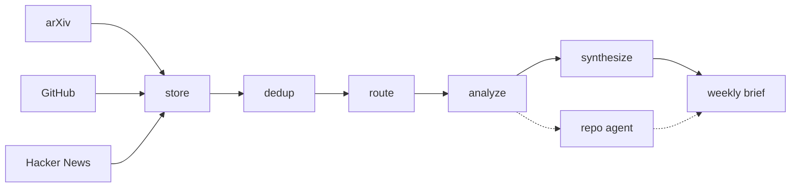

# Proofrun

An investigation agent that answers questions about newly published AI
repositories by reading them, searching the web, and running them in a
sandbox - and that keeps an evidence ledger separating what it **observed** by
running a command from what it merely **read**.

The name is that distinction: a proof run is a trial run you do before you
commit, and the only evidence Proofrun treats as first-hand is the kind it
produced itself.

It sits on top of a monitor that watches arXiv, GitHub, and Hacker News for
AI/ML developments, scores each item against configured interest areas, and
writes a weekly themed brief - which is where the questions come from.

Built to be honest about what it is. See [What is and isn't an agent
here](#what-is-and-isnt-an-agent-here) — that distinction is the point of the
architecture, not a disclaimer.

---

## What it does



1. **Watchers** fetch from three sources in parallel. Deterministic — no LLM.
2. **Dedup** collapses the same development appearing in several sources.
3. **Routing** drops items with no lexical overlap with any interest area, before
   anything is paid for.
4. **Analyzer** scores each surviving item with one structured Haiku call.
5. **Repo agent** investigates GitHub repos that scored well, deciding for itself
   how deep to look.
6. **Synthesis** writes a themed brief over the week's items.

---

## What is and isn't an agent here

Most of this system is not agentic, and saying so precisely is more useful than
calling everything an agent.

| Layer | What it is |
|---|---|
| Watchers | ETL. Deterministic fetch and normalize. No model involved. |
| Dedup / routing | Control flow. Rule-based, unit-tested, no model involved. |
| Analyzer / synthesis | Structured LLM calls. One shot, no loop, no tools. |
| **Repo agent** | **A real reasoning-action loop** — tools, model-driven decisions, a stopping condition. |

Only the last one earns the word. It gets three tools over the GitHub API and
chooses what to call next based on what it has seen. The escalation ladder
(metadata → file listing → file read) lives in the tool *descriptions*, not in
code that forces it — the model decides how deep a given repo warrants.

A real run against `langfuse/langfuse`:

```
step 1: get_repo_metadata(langfuse/langfuse)  →  description, topics, stars
step 2: (no tool call — answered instead)
stop_reason: sufficient_info   escalated to: metadata only
```

It stopped at the cheapest rung. Nothing told it to; the repo was obviously
relevant from metadata, so reading files would have been waste.

### The stopping conditions are real

An agent that cannot stop is not useful, so there are three ways the loop ends:

| Condition | Trigger |
|---|---|
| `sufficient_info` | The model answers instead of calling a tool. |
| `step_cap` | Model turns exceed the limit. |
| `cost_cap` | Accumulated spend reaches the ceiling. |

The caps are checked **in the loop before spending**, not requested in the
prompt. A prompt is a request, and a small model will ignore it. Tests assert
that a model which never stops calling tools still terminates, and that spend
halts at the ceiling rather than being noticed after the fact.

---

## Running it

```bash
python -m venv venv && source venv/bin/activate
pip install -r requirements.txt
cp .env.example .env          # add ANTHROPIC_API_KEY, optionally GITHUB_TOKEN
python check_api.py           # verify the key works (free - counts tokens, generates none)
```

Getting an API key, and why the Console is separate from claude.ai:
[docs/api-setup.md](docs/api-setup.md).

```bash
python run.py --dry-run                       # fetch and store only, no model calls
python run.py                                 # full pipeline, arXiv
python run.py --graph --sources arxiv github hn
python run.py --agent --agent-threshold 0.5   # investigate promising repos
python label.py                               # build the eval golden set
python evaluate.py                            # measure analyzer calibration
```

### Running free, locally

Every stage runs against a local Ollama model instead of the API:

```bash
ollama pull llama3.1
python run.py --provider ollama
```

This exists because development iteration is many cheap runs, while quality
judgments are few expensive ones. Local inference makes the first free. It is
*not* a substitute for the eval judge or for any number reported as a result —
see [decisions.md](docs/decisions.md#2-local-ollama-as-a-development-backend-claude-for-quality).

---

## Configuration

Interest areas live in [`ai_monitor/config/interests.yaml`](ai_monitor/config/interests.yaml):

```yaml
areas:
  agents:
    description: >
      Multi-agent systems, agentic workflows, LLM tool use, planning...
    keywords: [agent, agentic, tool use, orchestration, mcp]
```

The description is what the analyzer reasons against; the keywords drive the
free pre-filter. Both matter — the keywords cannot be too narrow, or relevant
items are dropped before a model ever sees them.

---

## Cost control

Four mechanisms, in the order they take effect:

1. **Keyword pre-filter** — items with no interest-area overlap never reach a
   model call.
2. **Content-hash idempotency** — re-running does not re-analyze unchanged items.
   Re-runs cost nothing for work already done. The model is part of that identity,
   so switching backends does re-analyze rather than silently keeping old scores.
3. **Model split** — Haiku 4.5 for high-volume per-item scoring, Sonnet 5 for
   synthesis and agent reasoning.
4. **Agent gating** — the expensive agent runs only on repos the cheap analyzer
   already scored above a threshold.

Every run reports its own cost:

```
analyzed 10, skipped 0 (unchanged), failed 0 | analysis cost $0.0000
brief: reports/2026-W35.md | synthesis $0.0000 | run total $0.0000
```

*(That run was local, hence $0.00. Figures from API runs come from actual token
logs — there are no estimated numbers in this README.)*

---

## Evaluation

Calibration is measured, not asserted. [`evaluate.py`](evaluate.py) reports two
comparisons that answer different questions:

- **Analyzer vs. your labels** — does the analyzer prompt need work?
- **Judge vs. your labels** — can the LLM judge stand in for hand-labeling on
  future items? This is what lets the harness scale past the golden set.

Two anchoring guards, each with a test asserting it: [`label.py`](label.py)
hides the analyzer's score while you label, and the judge never sees the
analyzer's output. Without those, both collapse into agreement and measure
nothing.

The report gives MAE, RMSE, Pearson r, precision/recall, signed bias, per-band
calibration, and the largest disagreements — because "MAE is 0.19" does not tell
you what to change, while "the 0.6–0.9 band runs +0.25 hot, and here are the five
items you disagreed with most" does.

### What it found

48 hand-labeled items, three scorers, $0.31 of API spend:

| comparison | Pearson r | MAE |
|---|---|---|
| Haiku analyzer vs human | +0.349 | 0.226 |
| Sonnet judge vs human | +0.257 | 0.298 |
| **Sonnet judge vs Haiku analyzer** | **+0.908** | **0.145** |

**The two models agree with each other almost perfectly while both diverge from
the human.** If model capability were the limitation, they would disagree with
each other too. They don't — so the gap is the *rubric*, not the model.

This falsified the harness's own premise. It was built assuming a validated
judge could replace hand-labeling on new items; measured, the judge predicts
human scores *worse* than the analyzer it was meant to audit. Using it as a
proxy would have measured model consensus while looking rigorous.

Reading the disagreements individually separated two causes that deserve
opposite treatment: a genuine **configuration gap** (a $13B acquisition matches
none of the four technical interest areas, yet is obviously major news) versus
**reader-specific taste** (one item was marked down for being already familiar —
novelty relative to what the reader knows, which a per-item scorer cannot see by
construction).

The conclusion was *not* to tune toward the labels. Full analysis:
[docs/eval-findings.md](docs/eval-findings.md).

For reference, the local development model on the same items scored r = 0.151
using 7 distinct score values; Haiku scored r = 0.349 using 16. The small model
was a real limitation for ranking — worth measuring rather than assuming.

---

## Tests

```bash
python -m pytest tests/ -q     # 184 tests, no network calls
```

The suite makes no API or network calls; every external service is stubbed.

Five bugs it caught that would otherwise have shipped silently — each one a
*quiet* failure, which is the kind worth having tests for:

- **SQLite connections cannot cross threads.** LangGraph parallelizes watcher
  branches; a broad `except` was converting the resulting error into a generic
  "watcher failed", so every run would have silently degraded. Watchers now fetch
  only, and all writes happen single-threaded in one node.
- **GitHub ANDs repeated `topic:` qualifiers.** A five-topic query asked for repos
  carrying all five and matched nothing. Now one request per topic, merged.
- **Editing the prompt did not invalidate cached analyses.** A prompt fix was
  indistinguishable from a prompt fix that does not work, since every item was
  skipped as unchanged. The system prompt is now hashed into the cache key, so
  edits self-invalidate with no version number to forget.
- **Switching models silently skipped re-analysis.** The idempotency check compared
  content only, so moving from a local model to Haiku left every item at the old
  score while the run reported "skipped (unchanged)" and looked healthy.
- **Word-boundary matching dropped plurals.** `\bagent\b` did not match "agents",
  silently discarding relevant items — the worse failure direction, since nothing
  signals a false drop.

---

## Known limitations

- **Star velocity is a proxy.** "Recently pushed and well-starred" is not the same
  as trending. True velocity needs two snapshots over time; star counts are stored
  on every run so it becomes computable once history accumulates.
- **HN items are title-only.** HN stories carry no body text, so analysis of an HN
  item works from its title alone. Fetching linked pages is out of scope.
- **Dedup is conservative.** Token-set title overlap merges "Agents that use tools"
  with "Tools that use agents". The threshold is deliberately high: a wrong merge
  hides a real item, which is worse than a duplicate a reader can see and ignore.
- **Agent coverage depends on analyzer calibration.** Gating means a miscalibrated
  analyzer silently starves the agent of work, with nothing to signal it.
- **No tracing UI.** Agent traces are queryable in `agent_runs` but there is no
  visual step-through. [Deferred deliberately](docs/decisions.md#4-no-tracing-backend-langfuse--phoenix-for-now).

---

## Layout

```
ai_monitor/
  watchers/      arxiv, github, hn — fetch and normalize
  orchestrator/  canonical, dedup, routing, graph (LangGraph)
  analysis/      per-item structured scoring
  agent/         tools, repo_agent (the loop), critique, runner (gating)
  synthesis/     themed weekly brief
  eval/          golden set, LLM judge, agreement metrics
  storage/       schema, idempotent upsert
docs/
  decisions.md   design decisions, with revisit conditions
```

Design decisions and the reasoning behind them — including ones later corrected —
are recorded in [docs/decisions.md](docs/decisions.md).
