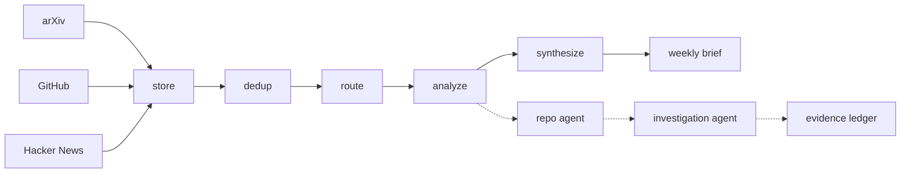

# Architecture

Proofrun is an investigation agent sitting on top of a monitor. The monitor
watches arXiv, GitHub and Hacker News, scores what it finds against configured
interest areas, and writes a themed brief from stored items. The agent answers
questions about the repositories that surface.



1. **Watchers** fetch from three sources sequentially by default, or in parallel
   with `--graph`. Deterministic — no LLM.
2. **Dedup** collapses the same development appearing in several sources.
3. **Routing** drops items with no lexical overlap with any interest area,
   before anything is paid for.
4. **Analyzer** scores each surviving item with one structured Haiku call.
5. **Repo agent** investigates repositories that scored well, deciding for
   itself how deep to look.
6. **Investigation agent** takes a *question* about one repository and answers
   it with reading, web search and sandboxed execution.
7. **Synthesis** writes a themed brief from scored items in storage. It selects
   by score across all stored dates, up to its item limit, with no week filter.

## What is and isn't an agent here

Most of this system is not agentic, and saying so precisely is more useful than
calling everything an agent.

| Layer | What it is |
|---|---|
| Watchers | ETL. Deterministic fetch and normalize. No model involved. |
| Dedup / routing | Control flow. Rule-based, unit-tested, no model involved. |
| Analyzer / synthesis | Structured LLM calls. One shot, no loop, no tools. |
| Repo agent | A reasoning-action loop over three read-only GitHub tools. |
| **Investigation agent** | **The same loop with execution, web search, and a ledger.** |

Both agents share one loop, `ai_monitor/agent/loop.py`. What that loop owns, and
what it deliberately does not:

- **It owns stopping.** Cost and wall-clock caps are checked between turns;
  a call can overshoot either threshold. Sandbox disk is checked after commands.
- **It does not own tools.** Callers pass an `execute` callable. The repo agent
  hands it a module-level registry; the investigation agent hands it a closure
  over one live sandbox, because sandbox tools are per-run state.
- **It does not own the conclusion.** The loop returns free text. Turning that
  into a schema is a separate cheap call, because a model cannot both call tools
  and be constrained to a final schema in the same turn.

## The escalation ladder

```
get_repo_metadata → get_repo_description → list_files → read_file
                  → web_search
                  → sandbox_clone → sandbox_setup → sandbox_run
```

The ladder lives in the tool **descriptions**, not in code that forces an order.
The model decides how deep a question warrants, and the eval scores whether it
chose the right rung — a question its metadata settles is *supposed* to end
without a container.

## Layout

```
ai_monitor/
  watchers/      arxiv, github, hn - fetch and normalize
  orchestrator/  canonical, dedup, routing, graph (LangGraph)
  analysis/      per-item structured scoring
  agent/
    loop.py                the reasoning-action loop, caps, trace
    sandbox.py             docker contract: three verbs, one volume
    tools.py               github read tools, web search, sandbox executor
    repo_agent.py          stage 1 agent (read-only)
    investigate.py         the investigation agent and the integrity rules
    critique.py            self-critique and revision pass
    investigate_runner.py  gating, batch, spend estimate
  eval/
    investigations.py      the six pass criteria and the scorer
    ...                    golden set, LLM judge, agreement metrics
  synthesis/     themed weekly brief
  storage/       schema, migrations, idempotent upsert
export_traces.py   static HTML for site/
questions.yaml     the 13-question eval set
docs/              decisions, ledger rules, eval, testing
site/              generated trace pages
```

## Configuration

Interest areas live in
[`ai_monitor/config/interests.yaml`](../ai_monitor/config/interests.yaml):

```yaml
areas:
  agents:
    description: >
      Multi-agent systems, agentic workflows, LLM tool use, planning...
    keywords: [agent, agentic, tool use, orchestration, mcp]
```

The description is what the analyzer reasons against; the keywords drive the
free pre-filter. Both matter — keywords that are too narrow drop relevant items
before a model ever sees them.

Investigation questions live in [`questions.yaml`](../questions.yaml), each
recording the repository's size, language and licence inline, and what a correct
answer looks like:

```yaml
- repo: maximhq/bifrost
  size_mb: 968
  language: Go
  licence: Apache-2.0
  question: >-
    Is maximhq/bifrost actually fifty times faster than LiteLLM, as its
    description claims?
  expect:
    verdict: [could_not_test, inconclusive]
    execution: forbidden        # metadata settles it; cloning is the wrong move
    blockers_any_of: [unsupported_language, needs_large_download, other]
```

## Running free, locally

Every non-sandbox stage runs against a local Ollama model instead of the API:

```bash
ollama pull llama3.1
python run.py --provider ollama
```

Development iteration is many cheap runs; quality judgements are few expensive
ones. Local inference makes the first free. It is *not* a substitute for the
eval judge or for any number reported as a result — see
[decisions.md §2](decisions.md#2-local-ollama-as-a-development-backend-claude-for-quality).

## Known limitations

- **Python only.** The read-only container root defeats toolchain installers
  that write outside `/work`, and non-Python repositories are refused at the
  clone. They produce an honest `could_not_test`, which is correct but narrow.
- **Web search results may be unreadable to the agent.** In the one run that
  used it, the agent reported that search returned opaque encrypted blocks
  rather than text. Not yet root-caused; treat web-search evidence as unproven
  until it is.
- **No long-lived services.** A fresh container per call means the agent cannot
  start a server in one call and curl it in the next.
- **Star velocity is a proxy.** True velocity needs two snapshots over time;
  star counts are stored on every run so it becomes computable with history.
- **HN items are title-only**, and **dedup is conservative** — a wrong merge
  hides a real item, which is worse than a visible duplicate.
- **Agent coverage depends on analyzer calibration.** Gating means a
  miscalibrated analyzer silently starves the agent of work.
- **No tracing UI.** Traces are queryable in SQL and rendered as static pages,
  but there is no live step-through.
  [Deferred deliberately](decisions.md#4-no-tracing-backend-langfuse--phoenix-for-now).

Eval-specific limits are in
[eval-investigations.md](eval-investigations.md#known-limits-of-this-eval).
